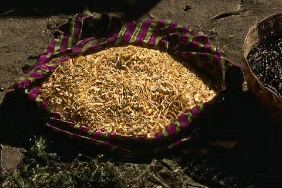

# EnhanceNet

Tensorflow implementation of EnhanceNet for a magnification ratio of 4.

**We slightly changed the procedure for training Enet as followings**
+ Discriminator has been changed like DCGAN.
+ We only used ```pool5_4 and conv3_1 features``` from VGG-19. See losses.py
+ So, we changed hyper-parameters for loss combination.

### Results
<table>
<tr align="center">
<td>Input</td>
<td>Enet-E</td>
<td>Enet-PAT</td>
</tr>
<tr align="center">
<td></td>
<td></td>
<td></td>
</tr>
</table>

### How to train?

1. Download COCO_train_DB for training ENet and unzip train2017.zip
```
wget http://images.cocodataset.org/zips/train2017.zip
unzip train2017.zip
```

2. Download VGG-19 slim model and untar
```
wget http://download.tensorflow.org/models/vgg_19_2016_08_28.tar.gz
tar xvzf vgg_19_2016_08_28.tar.gz
```

3. Do train!
```
# ENet-E
python3 train_SR.py --model=enhancenet --upsample=nearest \
--recon_type=residual --SR_scale=4 --run_gpu=0 \
--batch_size=32 --num_readers=4 --input_size=32 \
--losses='mse' \
--learning_rate=0.0001 \
--save_path=/your/models/will/be/saved \
--image_path=/where/is/your/COCODB/train2017/*.jpg

# ENet-PAT
python3 train_SR.py --model=enhancenet --upsample=nearest \
--recon_type=residual --SR_scale=4 --run_gpu=0 \
--batch_size=32 --num_readers=4 --input_size=32 \
--losses='perceptual,texture,adv' --adv_ver=ver2 \
--adv_gen_w=0.003 --learning_rate=0.0001 \
--save_path=/your/models/will/be/saved \
--image_path=/where/is/your/COCODB/train2017/*.jpg \
--vgg_path=/where/is/your/vgg19/vgg_19.ckpt
```

### How to test?

```
python3 test_SR.py --model_path=/your/pretrained/model/folder \
--image_path=/your/image/folder \
--save_path=/generated_image/will/be/saved/here \
--run_gpu=0
```

### Reference
```
@inproceedings{enhancenet,
  title={{EnhanceNet: Single Image Super-Resolution through Automated Texture Synthesis}},
  author={Sajjadi, Mehdi S. M. and Sch{\"o}lkopf, Bernhard and Hirsch, Michael},
  booktitle={Computer Vision (ICCV), 2017 IEEE International Conference on},
  pages={4501--4510},
  year={2017},
  organization={IEEE},
  url={https://arxiv.org/abs/1612.07919/}
}
```
